# NYC Taxi Data Analysis with Distributed Spark & Docker
## Environment Setup (Containers + Spark)
**Pull the spark image**:
```bash
docker pull apache/spark
```
## Run Spark in Standalone Mode (One Container)
You must specify the absolute path to the pyspark executable, which is typically located at /opt/spark/bin/pyspark.
```bash
docker run -it apache/spark /opt/spark/bin/pyspark
# docker run -it apache/spark bash
#     # inside the container
#     /opt/spark/bin/pyspark
```

**Run Sample spark operation**:
```python
sc.parallelize([1,2,3,4,5]).map(lambda x: x*x).collect() # Output: [1, 4, 9, 16, 25]
```
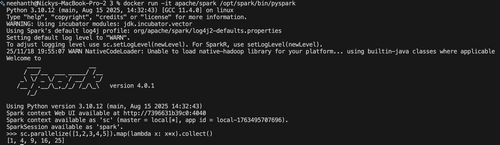

## Run Spark in Cluster Mode (Multiple Containers)
**Create a Docker network**
```bash
docker network create spark-net
```
**Start the Spark master**
```bash
docker run -d --name spark-master --network spark-net \
  -p 7077:7077 -p 8080:8080 \
  apache/spark \
  /opt/spark/bin/spark-class org.apache.spark.deploy.master.Master
```
**Start Spark workers**
```bash
docker run -d --name spark-worker-1 --network spark-net \
  -p 8081:8081 \
  apache/spark \
  /opt/spark/bin/spark-class org.apache.spark.deploy.worker.Worker spark://spark-master:7077

docker run -d --name spark-worker-2 --network spark-net \
  -p 8082:8081 \
  apache/spark \
  /opt/spark/bin/spark-class org.apache.spark.deploy.worker.Worker spark://spark-master:7077
```

**Access Spark UI**
* Spark Master Web UI: http://localhost:8080
* Worker UIs: http://localhost:8081 and http://localhost:8082

**Spark Master Web UI**:
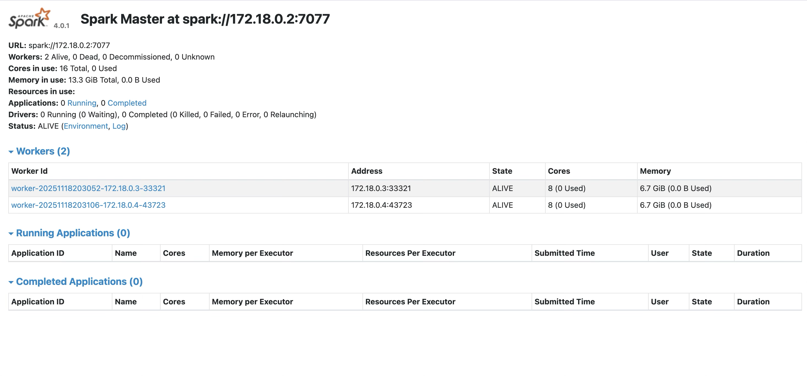

**Saprk Woker UIs**:
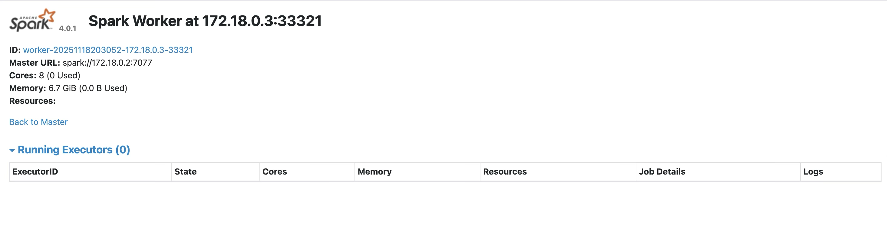
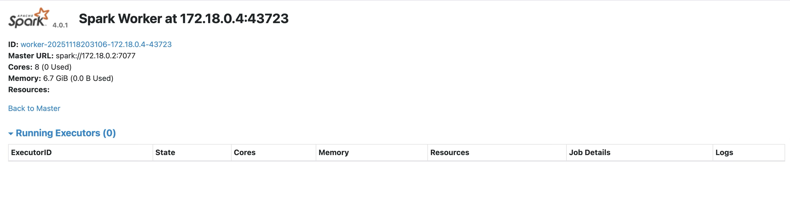

**Stop the containers**:
```bash
docker stop spark-master spark-worker-1 spark-worker-2
```
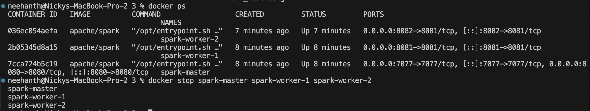

**To remove the containers use this command**:
```bash
docker rm -f spark-master spark-worker-1 spark-worker-2
```

## Run Spark in Cluster Mode using docker-compose
```bash
docker-compose up -d
```
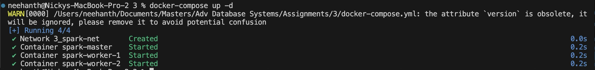

**Check status**:
```bash
docker-compose ps
```
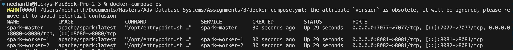

**Open a PySpark client attached to the cluster**:
```bash
docker run -it \
    --network 3_spark-net \
    apache/spark /opt/spark/bin/pyspark \
    --master spark://spark-master:7077
```
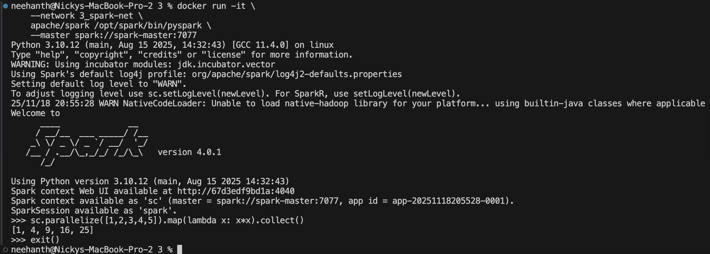

**Another way to connect**:
Alternatively, exec into the master and use `spark-submit`
```bash
docker exec -it spark-master bash
# inside the master container, run:
pyspark --master spark://spark-master:7077
# or submit a script:
spark-submit --master spark://spark-master:7077 your_script.py
```

**Stop and clean up**:
```bash
docker-compose down
```
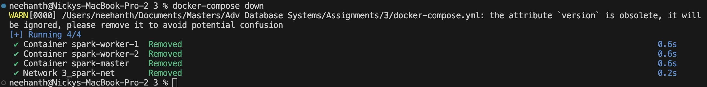

**Or Remove volumes or images if added**
```bash
docker-compose down --volumes --rmi local
```

## Test PySpark in the Cluster:
**Start a container attached to the cluster for PySpark client**:
```bash
# Create and Start the containers if not already
docker-compose up -d

# Open PySpark client
docker run -it \
    --network 3_spark-net \
    apache/spark /opt/spark/bin/pyspark \
    --master spark://spark-master:7077
```

**Run a small job**:
```python
rdd = sc.parallelize(range(1,100001))
rdd.sum()
```
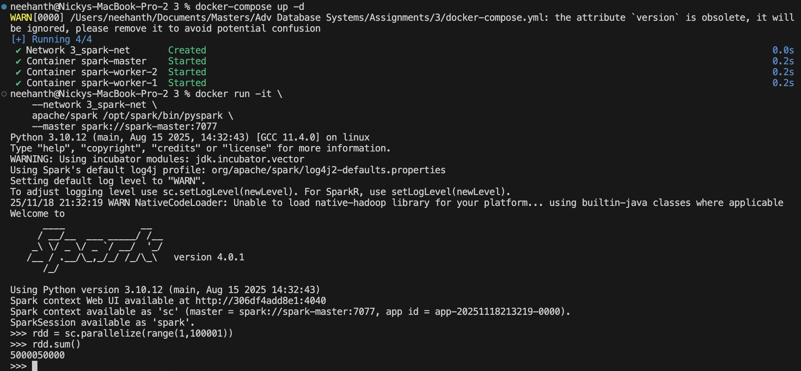

**Spark Master UI**:
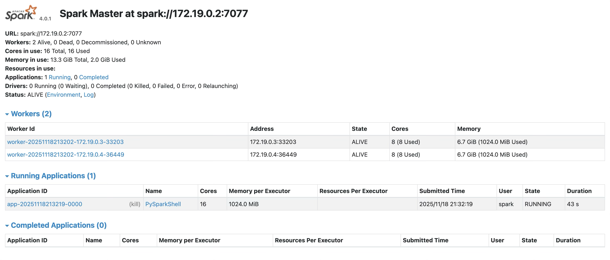
**Spark Worker UIs**:

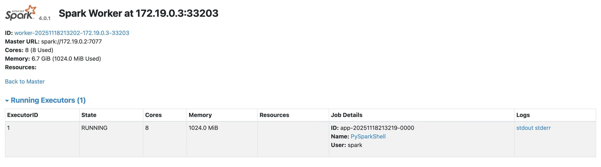

**Exit PySpark client**:
```Python
exit()
```

**Stop and clean**
```bash
docker-compose down
```
All the containers (`spark-master`, `spark-worker-1`, `spark-worker-2`) will be stopped and once stopped thery are deleted.

Network created will be deleted.


---

## Actual Task - Single vs Multiple Container for distributed Spark
### Run in Standalone Mode
```bash
docker run --rm -it \
  -v "$PWD":/opt/spark/work \
  -w /opt/spark/work \
  apache/spark \
  /opt/spark/bin/spark-submit \
  --master "local[*]" \
  nyc_taxi_sanity_check.py \
  --input sample_trips_small.csv \
  --output out_local_apache
```

**Results**:
```json
{
  "total_rows_read": 4,
  "null_counts": {
    "pickup_datetime": 0,
    "dropoff_datetime": 0,
    "trip_distance": 0,
    "fare_amount": 0,
    "passenger_count": 0
  },
  "timings_sec": {
    "read": 2.8633,
    "transform": 0.8283,
    "aggregate": 0.0318,
    "total": 4.428
  }
}
```
<!-- 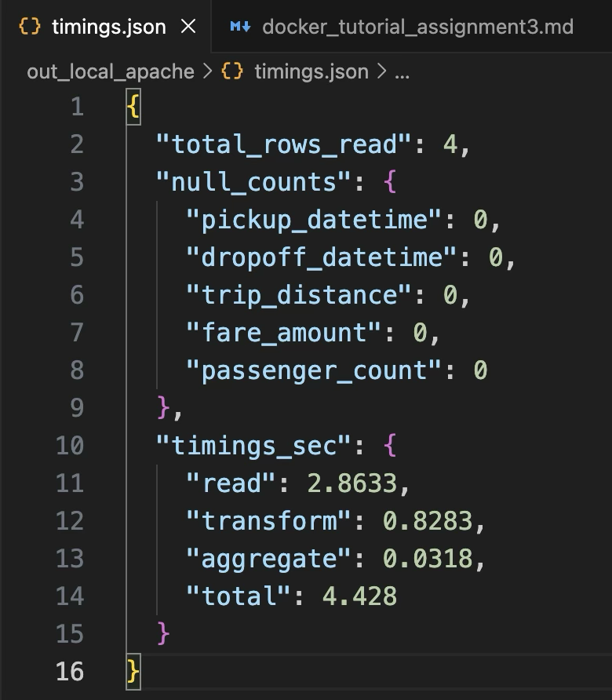 -->

### Run in Cluster (docker-compose) mode
```bash
docker-compose up -d
```

**Copy files into the master container**:
```bash
docker cp nyc_taxi_sanity_check.py spark-master:/opt/spark/app.py
docker cp sample_trips_small.csv spark-master:/opt/spark/data.csv
```

**Submit the job on the cluster**:
```bash
docker exec -it spark-master \
  /opt/spark/bin/spark-submit \
  --master spark://spark-master:7077 \
  /opt/spark/app.py \
  --input /opt/spark/data.csv \
  --output /opt/spark/out_cluster
```
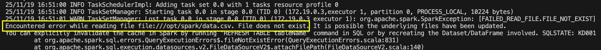

Spark job failed because it couldn't find the input CSV file (`data.csv`) at the expected location (`/opt/spark/data.csv`) inside the cluster nodes.
* Since I have copied the files to the Master, Worker containers do not have the copy of data.csv. 
* Worker looks in its own local filesystem, finds nothing, and crashes the task.

**Fix**: Used Docker Volumes
Stop the current cluster:
```bash
docker-compose down
```

**Update** `docker-compose.yml`:
Ensure both the master and worker services mount the local folder containing your data to the same path inside the container.
```bash
# Add this to Master and Workers
volumes:
    - ./:/opt/spark/work
```

**Restart the Cluster**:
```bash
docker-compose up -d
```

**Submit the Job Again**: instead of copying files, just point to the mounted path
```bash
docker exec -it spark-master \
  /opt/spark/bin/spark-submit \
  --master spark://spark-master:7077 \
  /opt/spark/work/nyc_taxi_sanity_check.py \
  --input /opt/spark/work/sample_trips_small.csv \
  --output /opt/spark/work/out_cluster_apache
```
✅ Successfully! submitted the Job:

**Results**:
```json
{
  "total_rows_read": 4,
  "null_counts": {
    "pickup_datetime": 0,
    "dropoff_datetime": 0,
    "trip_distance": 0,
    "fare_amount": 0,
    "passenger_count": 0
  },
  "timings_sec": {
    "read": 3.767,
    "transform": 1.4558,
    "aggregate": 0.0354,
    "total": 6.236
  }
}
```
<!-- 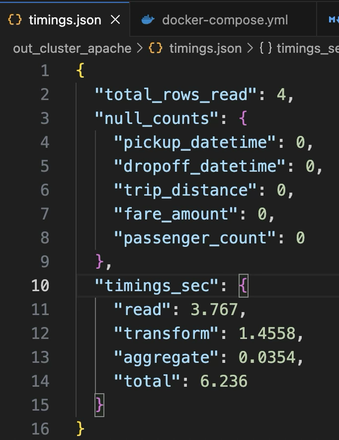 -->

**Stop the cluster**:
```bash
docker-compose down
```

## Testing with real NYC Taxi data
**Data** -> [`yellow_tripdata_202501.parquet`](https://d37ci6vzurychx.cloudfront.net/trip-data/yellow_tripdata_2025-01.parquet)

### Run in Standalone Mode
```bash
docker run --rm -it \
  -v "$PWD":/opt/spark/work \
  -w /opt/spark/work \
  apache/spark \
  /opt/spark/bin/spark-submit \
  --master "local[*]" \
  nyc_taxi_sanity_check.py \
  --input yellow_tripdata_202501.parquet \
  --output out_local_parquet
```

**Result**:
```json
{
  "total_rows_read": 3475226,
  "null_counts": {
    "tpep_pickup_datetime": 0,
    "tpep_dropoff_datetime": 0,
    "trip_distance": 0,
    "fare_amount": 0,
    "passenger_count": 540149
  },
  "timings_sec": {
    "read": 2.3623,
    "transform": 1.6127,
    "aggregate": 0.0326,
    "total": 5.4306
  }
}
```

### Run in Cluster Mode
```bash
# Start the cluster
docker-compose up -d

# Submit the Job
docker exec -it spark-master \
  /opt/spark/bin/spark-submit \
  --master spark://spark-master:7077 \
  /opt/spark/work/nyc_taxi_sanity_check.py \
  --input /opt/spark/work/yellow_tripdata_202501.parquet \
  --output /opt/spark/work/out_cluster_parquet

# Stop the cluster
docker-compose down
```

**Results**:
```json
{
  "total_rows_read": 3475226,
  "null_counts": {
    "tpep_pickup_datetime": 0,
    "tpep_dropoff_datetime": 0,
    "trip_distance": 0,
    "fare_amount": 0,
    "passenger_count": 540149
  },
  "timings_sec": {
    "read": 3.3698,
    "transform": 3.1341,
    "aggregate": 0.0334,
    "total": 8.6584
  }
}
```

## Observation & Analysis
* Performance Impact: The cluster mode performed 59% slower (8.66s vs 5.43s) than standalone mode, exhibiting negative scaling for this workload.
* Overhead Breakdown:
  - Read: +43% slower (3.37s vs 2.36s) - network I/O and data distribution costs.
  - Transform: +94% slower (3.13s vs 1.61s) - inter-worker communication and coordination overhead.
  - Aggregate: Negligible difference (~0.0008s) - minimal data shuffling required.

**Key Findings**:
* The master-worker architecture introduces latency in task assignment and result collection.
* Adding workers provided no performance improvement, indicating the workload is not compute-bound.

## Spark UI
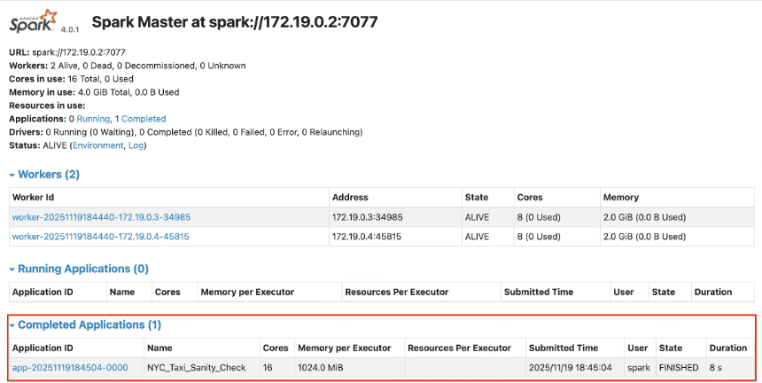

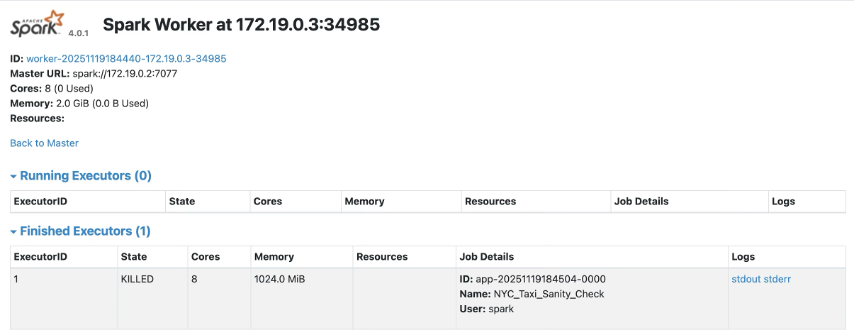

